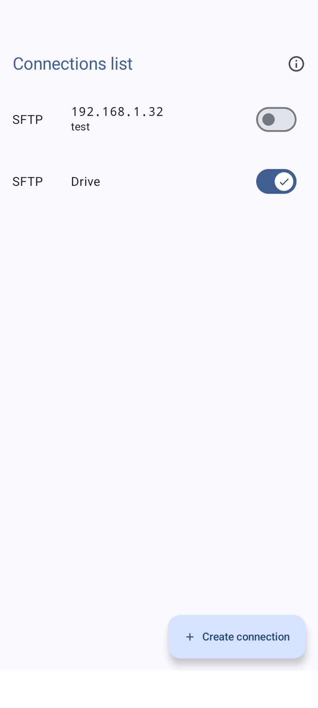
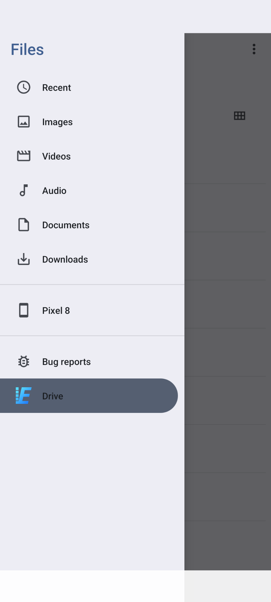
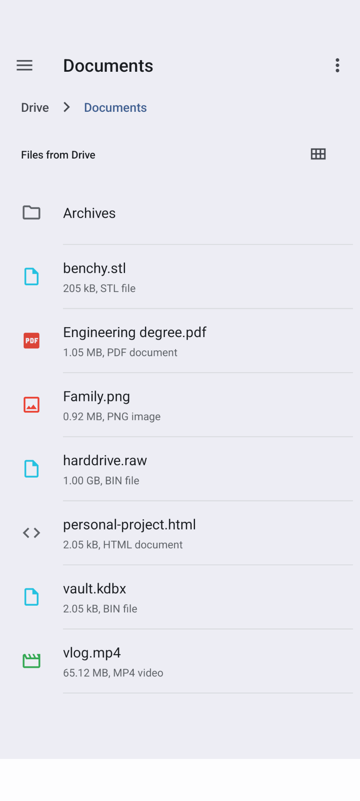

# Trante

> Tran...sfer from remo...te storages.

  
  
  

## Installation

- Google Play
- F-Droid
- [GitHub release](https://github.com/Chiogros/Trante/releases)

## Usage

1. Create a connection.
2. Enable the connection. ✔️ is displayed in the button if connection succeed.
3. Go to your File manager, you may find your remote storage in a side panel or in a dedicated
   section.

## Contributing

Great! Give a look at this [contributing guide](CONTRIBUTING.md).
