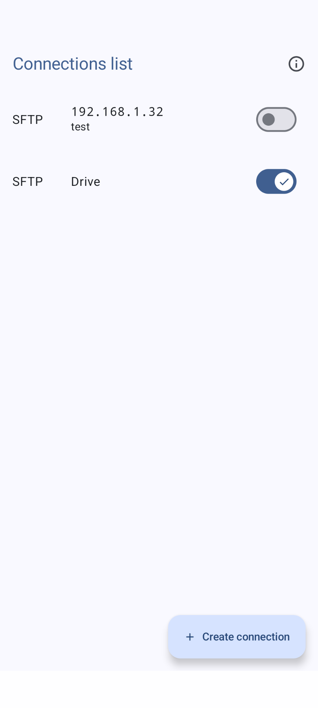
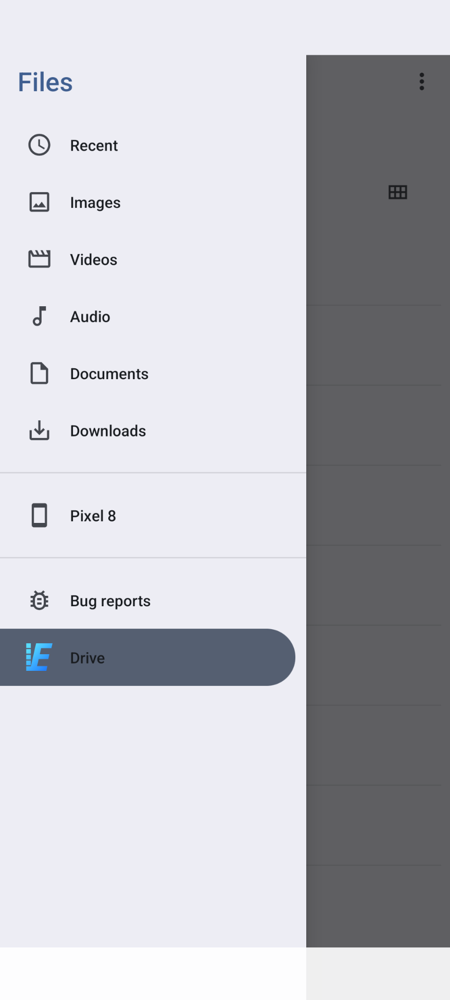
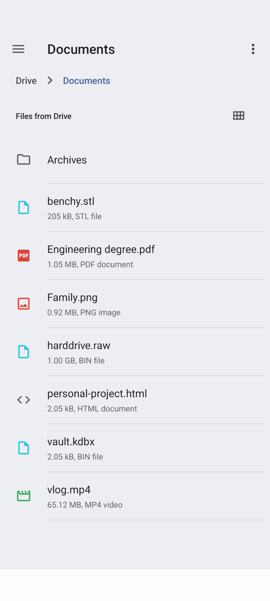

# Trante

_Browse remote storages from Android through SFTP._

|                                             Home screen                                              |                                         Access from file manager                                         |                       Seamless files browsing                       |
|:----------------------------------------------------------------------------------------------------:|:--------------------------------------------------------------------------------------------------------:|:-------------------------------------------------------------------:|
|  |  |  |

## Installation

- Google Play
- F-Droid
- [GitHub release](https://github.com/Chiogros/Trante/releases)

## Usage

1. Create a connection.
2. Enable the connection. ✔️ is displayed in the button if connection succeed.
3. Go to your File manager, you may find your remote storage in a side panel or in a dedicated
   section.

## Security and Privacy

No tracking, no data sharing.

Your sensitive data, such as passwords, are stored encrypted
in [Room](https://developer.android.com/training/data-storage/room) on your device using
_AES-256-GCM_[^enisa].

Data encryption keys and operations are handled
by [Android Keystore system](https://developer.android.com/privacy-and-security/keystore).

Sensitive data flow looks:
UI (data
decrypted) <---> [CryptoUtils](app/src/main/java/chiogros/trante/data/room/crypto/CryptoUtils.kt) <--->
Room (data encrypted)

Memory Tagging Extension enabled. No WebView.
No [DCL](https://developer.android.com/privacy-and-security/risks/dynamic-code-loading) via memory
nor storage.

Efforts are ongoing to make [reproductive builds](https://reproducible-builds.org), so you can
verify app's integrity.

[^enisa]: is recommended
from [Agreed Cryptographic Mechanisms, ENISA, 2025](https://certification.enisa.europa.eu/document/download/a845662b-aee0-484e-9191-890c4cfa7aaa_en?filename=ECCG%20Agreed%20Cryptographic%20Mechanisms%20version%202.pdf)
and [Broken or risky cryptographic algorithm, Android](https://developer.android.com/privacy-and-security/risks/broken-cryptographic-algorithm#weak-or-broken-cryptographic-encryption-functions-use-strong-cryptographic-algorithms-in-encryption-1B2M2Y8Asg).

## Contributing

Great! Give a look at this [contributing guide](CONTRIBUTING.md).
